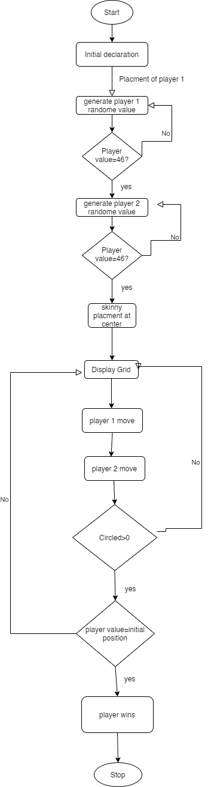
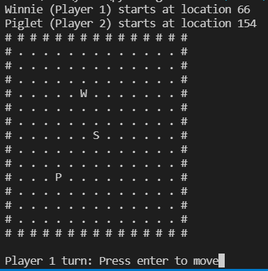
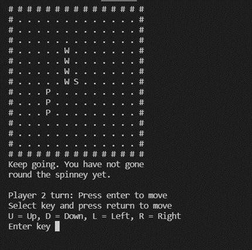
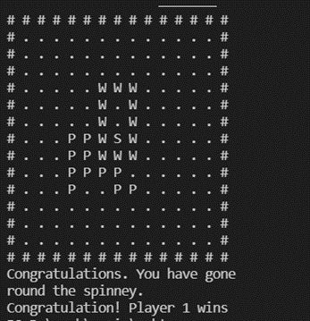
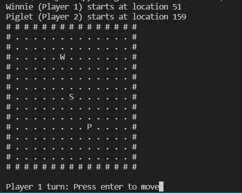
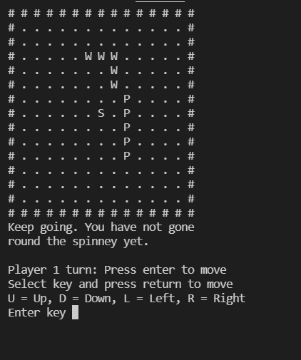
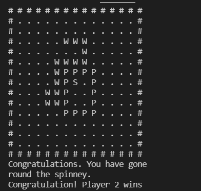

# Overview
'Where the Woozle Wasn't' is a British children's board game, briefly 
popular in the early 20th Century and based upon Chapter Three of A. A. 
Milne's classic 'Winnie the Pooh'. Chapter Three is subtitled 'In which 
Pooh and Piglet go hunting and nearly catch a Woozle.' It relates an 
occasion when Winnie the Pooh and Piglet find mysterious footprints in
the snow. They investigate. The trail goes round a spinney (a small wood) 
of larch trees and they follow. Their reason is that the footprints must have 
been made by a mysterious, and possibly fierce, creature and they 
immediately call it a Woozle. They walk round the spinney twice before 
realising they are simply following their own trail in the snow. 'I have been 
Foolish and Deluded,' Pooh observes wryly.

# Game Play

1. There are two players represented by letters W and P on the grid.
2. The spinney is represented by a letter S.
3. The players take turns to move their letter by one space up, down, left 
or right.
4. The route left by player’s letters should go all the way round the spinney.
5. Each player has to return to their initial position. Their route should 
'join up'.
6, When one of the players reaches their initial position the game should 
stop.
7. When the game stops it should say whether Player W or Player P has 
won.

# Game Play flowchart

# Game play

## Play 1

### Before start

### During gameplay

### final result

### Comments
So as we can see both players started their round from initial position but player W completed the round around S and reach back to its initial placement so Its wins.
## Play 2

### Before start

### During gameplay

### final result

### Comments
So as we can see both players started their round from initial position but player P completed the round around S and reach back to its initial placement so Its wins.
# logic

## The function display():
The ’Frank Drake’ algorithm, which we have studied, uses nested for 
loops to convert a one dimensional numerical array holding ASCII values 
into a two dimensional diagram.
This function is passed two variables. The first variable is always SNOW. 
The second variable is always TICK. (TICK is a little like a clock, counting 
how many times the function is called.) 
The function returns a new value for TICK.
## The function place():
This function is used at the very beginning of the game to choose at 
random the position of the spinney and the initial position of the letter W 
(for Winnie the Pooh) and initial position of the letter P (for Piglet).
This function is passed one variable. This variable will be "S", "W" or "P". 
The function returns a value. The value will be an array subscript for 
SNOW.
## The function init():
This function is used just once at the beginning of the game. It initialises 
the array SNOW.
The function is passed one variable. This is SNOW.
The function returns one value. This is an new array containing the border 
of the game ( the # characters.)
## The function row()
This function is essential for the operation of the program.

## The function passed()
This function is also essential for the operation of the program.

## The function check()
This function is used to check whether a player has reached the other side 
of the spinney.
It is passed five variables. These are (in order) the location of the player, 
the location of the spinney, the TICK variable, the EVENT variable and 
the CIRCLED variable.
It returns two variables, the EVENT variable and the CIRCLED variable. 
The value of the CIRCLED variable will be greater than 1 if the player has 
reached the other side of the spinney. Knowing this is important because 
in the game Winnie the Pooh and Piglet have to go round the spinney 
completely and get back to where they started. 

## The function move():
This is the function which allows a player to move their letter.
The function is passed one variable. This is the current player position.
The function returns one variable. This is the new player position.

## The function main():
As this game require two players to play at alternative turns, so first of all initial placement of player-1 W and player-2 P should be made on board. As to keep record of initial placement of both players , there should be two variables to keep track of initial placement of both players which is generated randomly from place()  function. Also place return random value on grid or board but we cant place letters on border of board, to check that we have to get value again and again until value is not equal to board border # ascii value which is 35. Soto achieve that we have to use infinite while loop and break it when value is 46 which is . on board. Then  a game start which should ask each player again and again to move their letter on board until player have gone around spinny which is placed at center of board. To check that we can use check() function. Then A player which if it has gone around spiny and comes back to it initial position.  So to achieve that infinite while loop will ask both players again and again to move until check() return value greater then 1 and player position is equal to variables which we declare at start to keep track of initial placement of players. Then loop terminates and tell which player has won the game.

